# Remote code system

[TOC]

## Overview

The remote code system is a tool for easily instantiating GPU accelerated vs-code instances in the browser. These instances can subsequently be used to run GPU accelerated ML library's like TensorFlow. The system is designed to have 2 groups: Administrators capable of generating new templates and sharing links to initialize these templates. Users capable of creating a new instance of a generated template from the link provided by an administrator. 

Architecturally the system consists of a master node responsible for serving the web page and organizing the workers who are managing the containers locally on different working nodes. The uml diagram below shows the system setup

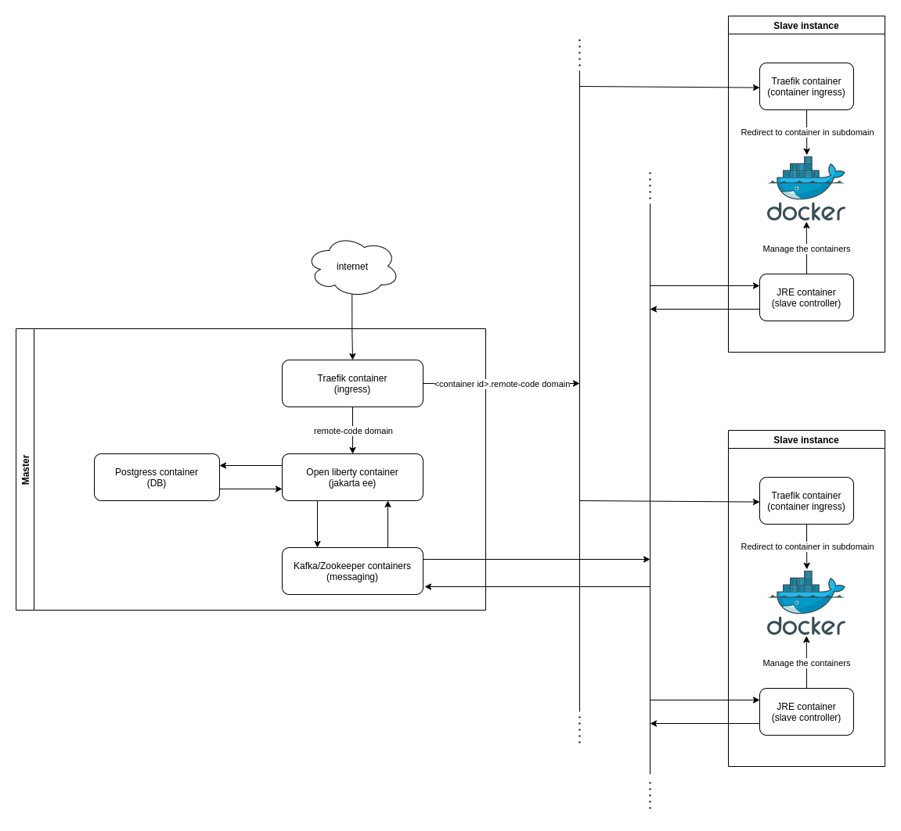

## The system from a users perspective

Users of the remote-code system will have 2 entry points into the application. Ether through a link or the login screen. The 2 approaches will be shown below. 

### Method 1 through a link

The first and most used method of access is through clicking on a project link. This will lead the user ether to the login page if not logged in or to the project info page if logged in. On the login page the the user can ether log in or create an account. The current login system is flexible and can easily be augmented to use third party login like Google or FEIDE.  In the project info page 

#### Uml

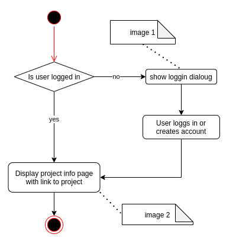
*Uml diagram of the activity flow*

#### Login page

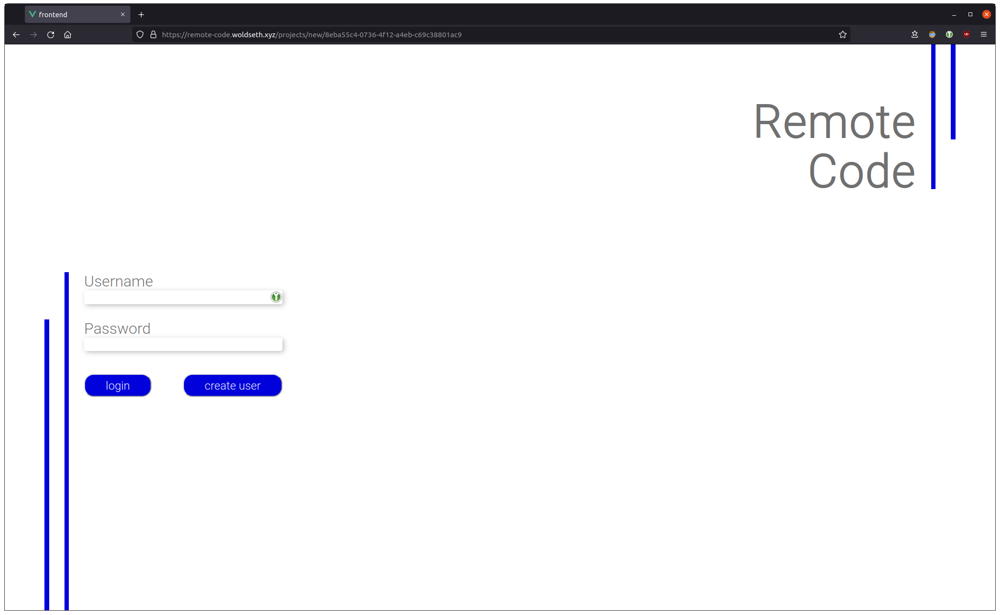
*Image 1: The login screen shown to user who are not logged in*

#### Project dialog

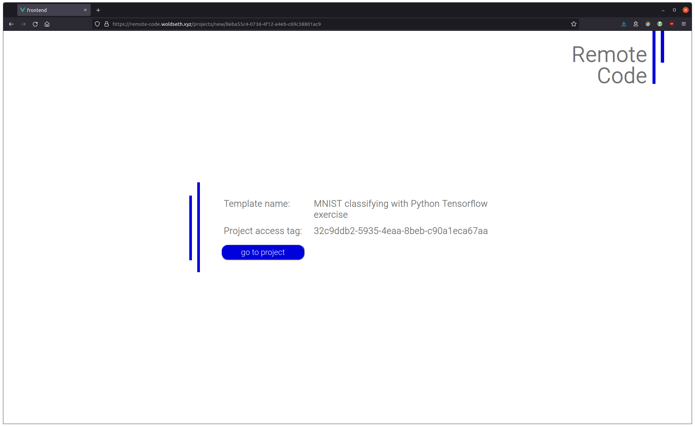
*Image 2: the project info page. Here users can see the project acces key if key is enabled, and a button that takes them to the project*

### Method 2 through the login portal

The other way for users to access their projects are through the projects page. The login is the same as over. In the project page the users will se their own projects, status for the project containers, link to go to the container, and the option to delete the container

#### The user projects page

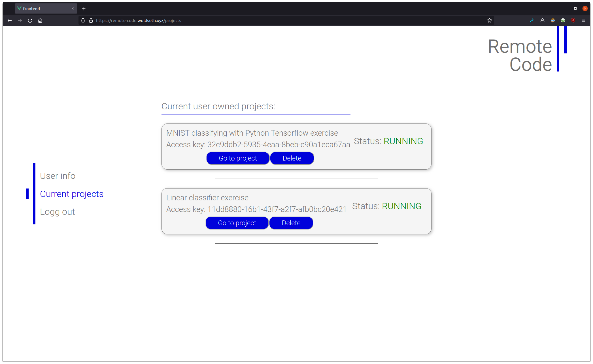
*The user projects page*

## The system from a admins perspective

ability to do all the actions user where able to do. but in addition, gets the ability to: 

- Create new templates other can build images from.
- Edit/delete owned templates templates. 
- Create other admin users. 

There are 2 ways of becoming an administrator ether by being added by another administrator, or by having the account in the master startup files. 

### Create new template

To create a new template the administrator has to navigate to the new template option in the side navigation. This will take the administrator to the create Template page. Here the administrator can define what the template is called what repository shod be cloned in to the starting directory and how the docker image shod be built. When the admin clicks save button (s)he will be navigated to the current templates page where the template will be located. this page wil be discussed in the next section.

The Docker build steps only allows ``RUN`` or ``ENV`` lines, the image is built from a Cuda cudnn image to provide the gpu acceleration.

#### New template page

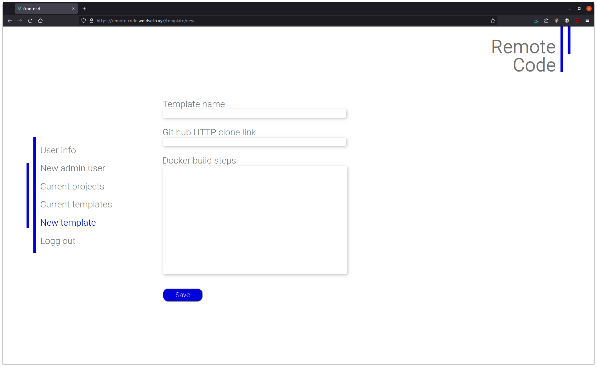
*the page for adding new templates*

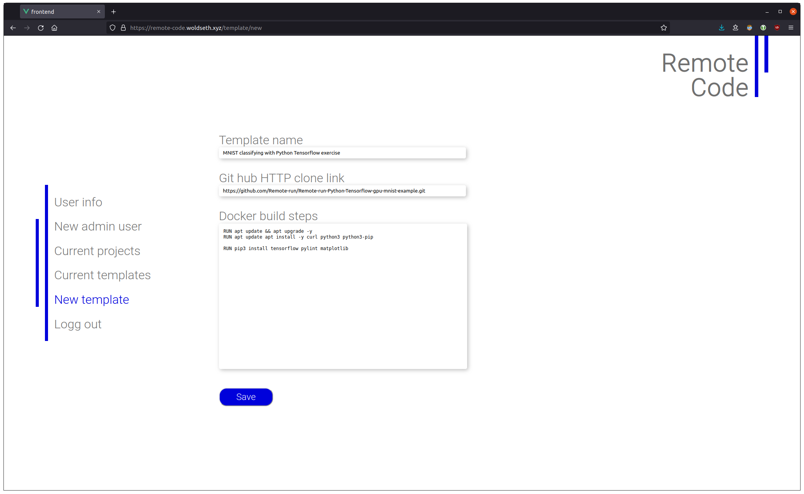
*new template page with the values used to create the mnst example

### Edit / delete templates

The current templates page contains a list over the owned admin templates. On this page the admin can delete/edit the different templates (s)he has created.

#### The current user templates page

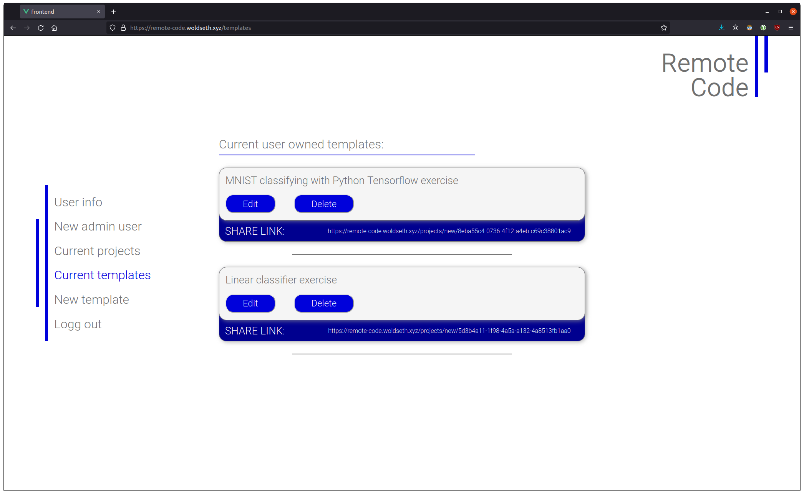
*list over templates owned by the current administrator*

### Create new admin user

To create a new administrator throug the web page the logged in admin has to navigate to the *New admin user* page. On this page there is a simple form for adding new administrators.

#### New admin page

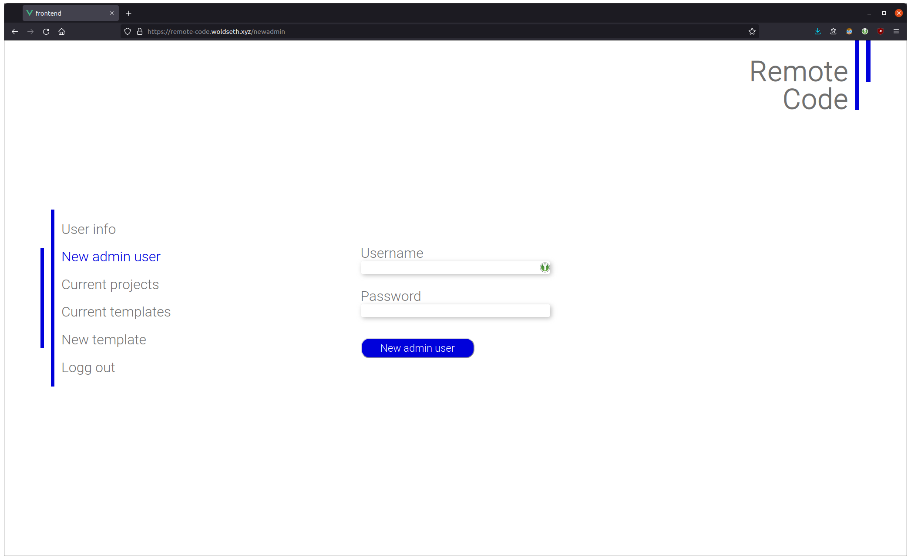

## Vs-code instance

The project cloned in both instances where a MNIST demo. when clicking the link, ether through my projects or the project info page the user will be met with a vs-code instance in the browser with the directory cloned from the template specification open. The repository is cloned when building the individual containers so updates to the repository can be completed post template generation. 

#### Landing page in project

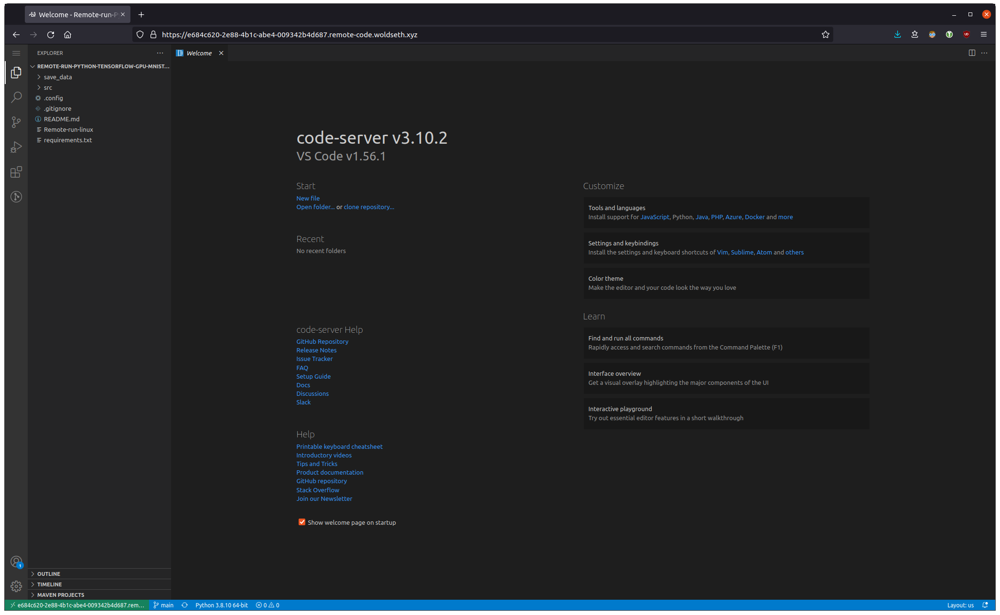
*here we can see the usual welcom page in vs code with the template repository cloned in to the side bar*

#### Running ML in the project

In the project the user can easily run GPU accelerated ML instances from the IDE terminal. Because the session persists the user can close the browser while the training is running and open it later to get the results

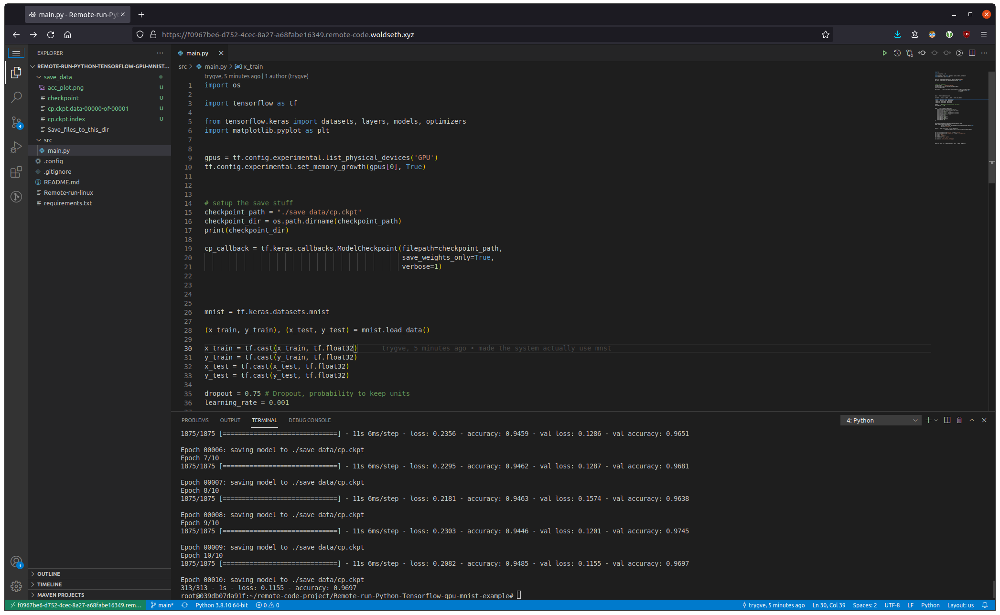
*In the console at the bottom we can see a 97% accurate MNIST classifier has been trained through the browser. Also note the model has been saved to the save_data seen in the file tree on the left, from where it can be downloaded for future use.*

### Multi staged training with remote-run 

The repository cloned above is a remote-run compatible repository, this means that training tasks can be delegated to a running remote run server where it can be trained. 

One scenario this cold be useful is by having a large numer of low cost GPU's for running the remote-code session's and enabling users to live debug and run their code. When the code is working and a long training session is needed this can be delegated to a remote-run cluster with high performance GPU's  for fast training. In this way the the system owner will  benefit from a more targeted utilization of their resources. i.e. 

- For development, where availability is more important than speed. A remote-code cluster running on a of a high number of low cost gpus can provide easy quick way to test and develop.
- For "Production"/ long training sessions, where quick completion time is the most important factor, the developer can simply send the project developed and tested on remote-code to a remote run cluster with high performance gpu's, and simply receive a mail with the training result when the training is complete.

#### Running remote-run from a remote-code instance

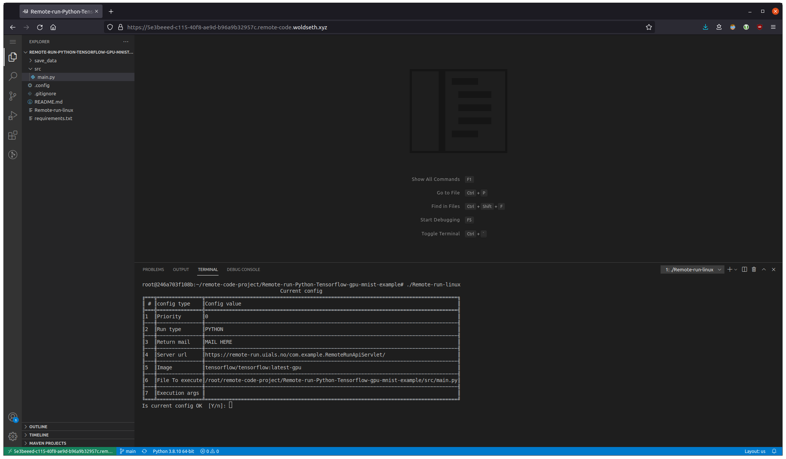
*In the console a remote-run client dialog can be seen*

